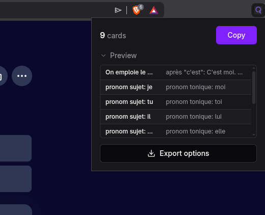
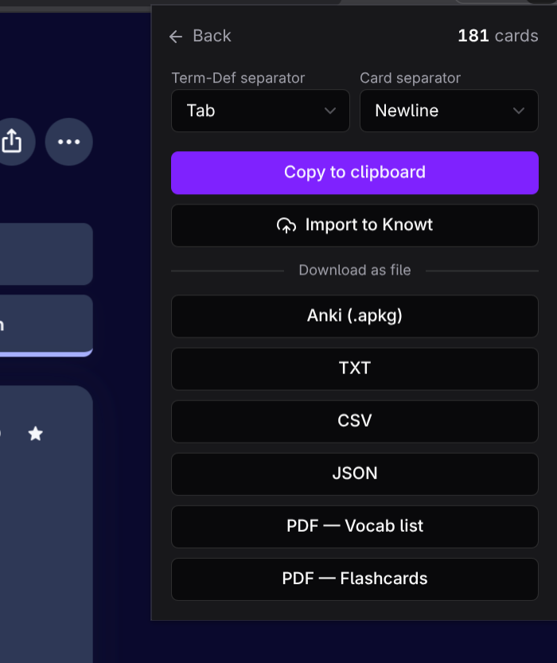
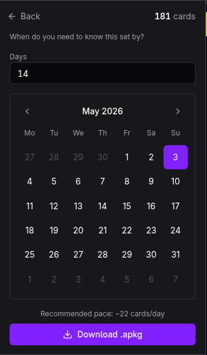
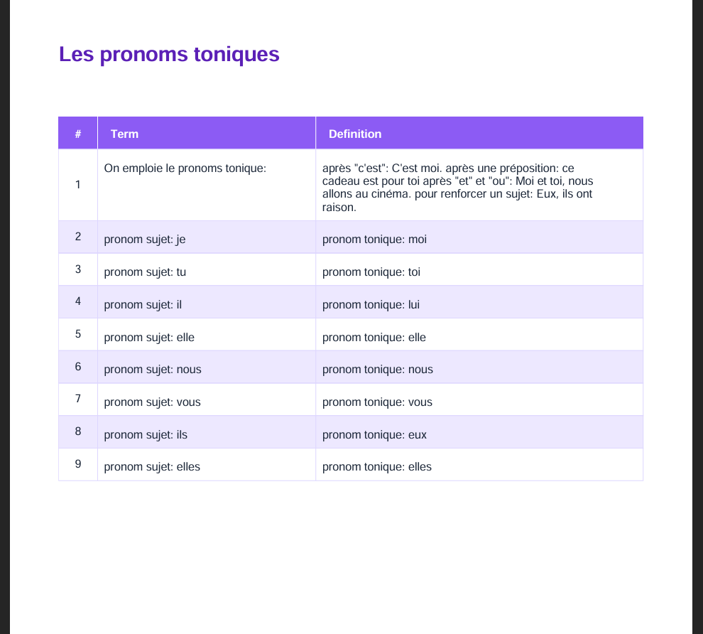
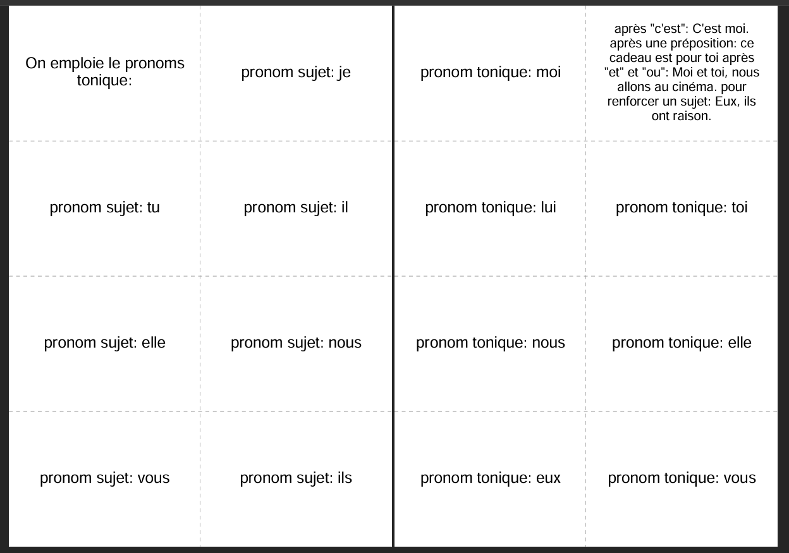
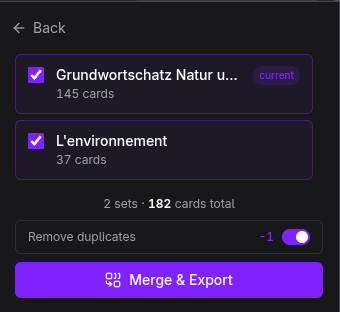

# QuickCards

Export Quizlet flashcards and vocab lists to TXT, CSV, JSON, PDF, and Anki — no account, no server.

[](LICENSE)
[](https://github.com/ImGajeed76/quick-cards/releases/latest)
[](https://quickcards.oseifert.ch)



## Two ways to use it

**Web** — [quickcards.oseifert.ch](https://quickcards.oseifert.ch)
Paste a vocab list, JSON, CSV, TSV, Markdown table, or TOML and get exports. Nothing to install. Share the URL and the export reproduces on the other side.

**Chrome extension** — [install instructions](extension/README.md#install)
Works directly on Quizlet set pages: floating banner, one-click copy, merge multiple open tabs into a single export. Fetches cards from Quizlet's web API (no login required).

## Features

- **Paste anything** — single or multiple Quizlet URLs, vocab lists with 15+ separator styles, JSON (common shapes: `{term,definition}`, `{front,back}`, tuples, flat key→value), JSON Lines, quoted CSV, TSV, Markdown tables, TOML
- **Six export formats** — TXT, CSV, JSON, PDF vocab list, printable PDF flashcards (2×4 grid, double-sided, syllable hyphenation), Anki `.apkg`
- **Anki with FSRS deadline pacing** — pick a target date, get a deck with retention and learning steps tuned to the time you have
- **Merge multiple sets** (extension) — combine cards from all open Quizlet tabs, with duplicate-removal toggle
- **Shareable URLs** (web) — the full card set is compressed into the URL; anyone with the link sees the same export
- **Client-side only** — no server, no account, no data leaves your browser

## Screenshots

| Popup | Export | Anki picker |
|:-:|:-:|:-:|
|  |  |  |

| PDF vocab list | PDF flashcards | Merge sets |
|:-:|:-:|:-:|
|  |  |  |

## Repository layout

```
├── extension/       Chrome extension — source, build, manifest
├── website/         SvelteKit web app — hosted at quickcards.oseifert.ch
├── assets/          Shared screenshots
└── LICENSE          MIT
```

- [`extension/README.md`](extension/README.md) — install, dev, release
- [`website/README.md`](website/README.md) — dev, architecture, deploy

## Tech stack

**Extension** — TypeScript, Bun, Alpine.js (CSP build), Tailwind v4, jsPDF + hyphen, ankipack + sql.js, Chrome Extension Manifest V3

**Web** — SvelteKit 2, Svelte 5 (runes), Tailwind v4, shadcn-svelte, Lucide, lz-string, jsPDF, ankipack, sql.js

## Develop

```bash
# Extension
cd extension
bun install
bun run build      # → extension/dist/
bun run dev        # Vite preview of popup HTML

# Web
cd website
bun install
bun run dev        # localhost:5173
bun run build      # → website/build/ (static)
bun test           # parser unit tests (73)
```

## Release

**Extension** — push a version tag, GitHub Actions builds and zips, publishes a GitHub Release with auto-generated notes.

```bash
git tag v1.3.1 && git push origin v1.3.1
```

**Web** — `main` auto-deploys to Vercel (static build, pure client-side, no runtime server).

## License

[MIT](LICENSE) · © Oliver Seifert
