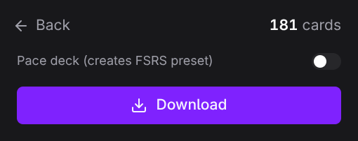

# QuickCards

Chrome extension to export Quizlet flashcards quickly.

Copy to clipboard, download as PDF, Anki, TXT, CSV, or JSON, or import directly into your Knowt account, all from a clean dark-themed popup.

[](https://chromewebstore.google.com/detail/quickcards/kjbjdolelcchfcmainniifnpkgikjfkc)

> Also available as a web app at **[quickcards.oseifert.ch](https://quickcards.oseifert.ch)**. Paste vocab lists, JSON, or CSV and get the same exports, no install.


## Features

- **No login required.** Fetches cards directly via Quizlet's web API, no account needed.
- **Merge sets.** Combine cards from multiple open Quizlet tabs into a single export, with automatic duplicate removal.
- **Instant copy.** One click from the floating banner or popup.
- **Export formats.** PDF vocab list, PDF printable flashcards, Anki `.apkg` (with images and audio bundled), TXT, CSV, JSON.
- **Import to Knowt.** Create a new flashcard set on your Knowt account with one click. Reuses your existing Knowt session; no separate login, no API key.
- **Anki export with media + optional pacing.** Cards land in two decks (flip + typing) on a media-aware notetype: images, user audio, and Quizlet TTS bundled into the `.apkg`. Optional toggle ships an FSRS preset tuned to your deadline; off uses Anki's default scheduling.
- **Customizable separators.** Pick a preset or type your own for term-definition and card separators.
- **Floating banner.** Auto-appears on Quizlet set pages with card count and quick copy.
- **PDF vocab list.** Formatted table with title, numbering, and alternating row tints.
- **PDF flashcards.** 2x4 grid, double-sided (terms front, definitions back mirrored for printing), auto-wrapping text with syllable-based hyphenation.
- **Settings persistence.** Separator preferences saved across sessions.

## Screenshots

### Floating banner

Appears automatically on Quizlet set pages (bottom-right).


### Export screen

Separator combos, clipboard copy, and all download options.


### Merge sets

Combine cards from multiple open Quizlet tabs into one export.

|                       Main screen                        |                Merge screen                 |                      Merged export                       |
| :------------------------------------------------------: | :-----------------------------------------: | :------------------------------------------------------: |
|  |  |  |

### Anki export

Two decks: the main flashcards deck (both directions) and a typing deck (both directions, skipped on cards with no typeable answer). The notetype is media-aware: images, user-recorded audio, and Quizlet TTS are downloaded in parallel and bundled into the `.apkg` so cards work offline. Toggle "Pace to deadline" on to bundle an FSRS preset tuned to the date you pick (shorter deadlines = higher desired retention + more aggressive learning steps); off ships no preset and Anki uses its default scheduling.

|                  Paced                   |                      No preset                       |
| :--------------------------------------: | :--------------------------------------------------: |
|  |  |

### Import to Knowt

Create a new flashcard set on your Knowt account in one click. Title and description prefill from the Quizlet set; new sets default to private.

|                        Form                        |                        Importing                         |
| :------------------------------------------------: | :------------------------------------------------------: |
|  |  |

### Vocab list PDF

Formatted table with violet header and alternating row tints.


### Flashcards PDF

Double-sided 2x4 grid with cut guides. Print, fold, study.


## Install

The extension lives in the Chrome Web Store. One click and you're done:

[](https://chromewebstore.google.com/detail/quickcards/kjbjdolelcchfcmainniifnpkgikjfkc)

### Sideload (manual install)

For developers or users who want to run a local build:

**From a release ZIP**

1. Download the latest `quick-cards-v*.zip` from [Releases](https://github.com/ImGajeed76/quick-cards/releases)
2. Unzip the archive
3. Open `chrome://extensions`, enable **Developer mode**, and click **Load unpacked**
4. Select the unzipped folder

**From source**

1. Clone the repo and install dependencies:

   ```bash
   git clone https://github.com/ImGajeed76/quick-cards.git
   cd quick-cards/extension
   bun install
   ```

2. Build the extension:

   ```bash
   bun run build
   ```

3. Load in Chrome:
   - Open `chrome://extensions`
   - Enable **Developer mode**
   - Click **Load unpacked** and select the `dist/` folder

## Development

```bash
# Build extension (output: dist/)
bun run build

# Dev preview (Vite, opens localhost:3000)
bun run dev

# Generate test PDFs (output: test/output/)
bun run test:pdf
```

## Releasing

Pushing a version tag triggers a GitHub Actions workflow that builds the extension, zips it, and creates a GitHub Release with auto-generated notes.

```bash
git tag v1.5.0
git push origin v1.5.0
```

The manifest version is automatically patched to match the tag. Pre-release tags (e.g. `v2.0.0-beta.1`) are marked as pre-releases.

## How it works

QuickCards fetches flashcard data directly from Quizlet's web API (`/webapi/3.4/studiable-item-documents`). No login or account required. It automatically paginates to retrieve all cards, even for large sets. If the API is unavailable, it falls back to scraping Quizlet's embedded `__NEXT_DATA__` JSON.

**Import to Knowt** uses the same trick in reverse. When you click the button, the extension reads Knowt's Cognito ID token from the cookie already set on `knowt.com`, decodes your user ID from it, and calls Knowt's AppSync GraphQL endpoint, the same one Knowt's own web app uses. Two mutations: one creates the set shell with your title and description, the second fills in the cards (chunked in batches of 100). Nothing is stored; the token never leaves your browser.

## Tech stack

- [Bun](https://bun.sh) for build, bundle, and tests
- [TypeScript](https://www.typescriptlang.org)
- [Alpine.js](https://alpinejs.dev) (CSP build) for popup interactivity
- [Tailwind CSS v4](https://tailwindcss.com) for styling
- [jsPDF](https://github.com/parallax/jsPDF) for PDF generation
- [hyphen](https://github.com/ytiurin/hyphen) for syllable-based word breaking in PDFs
- [ankipack](https://github.com/ImGajeed76/ankipack) for `.apkg` generation
- [sql.js](https://github.com/sql-js/sql.js), SQLite in WebAssembly (used by ankipack)
- Chrome Extension Manifest V3

## License

[MIT](../LICENSE)
