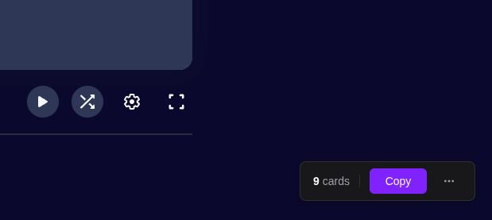
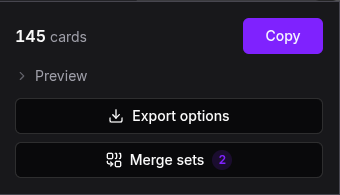
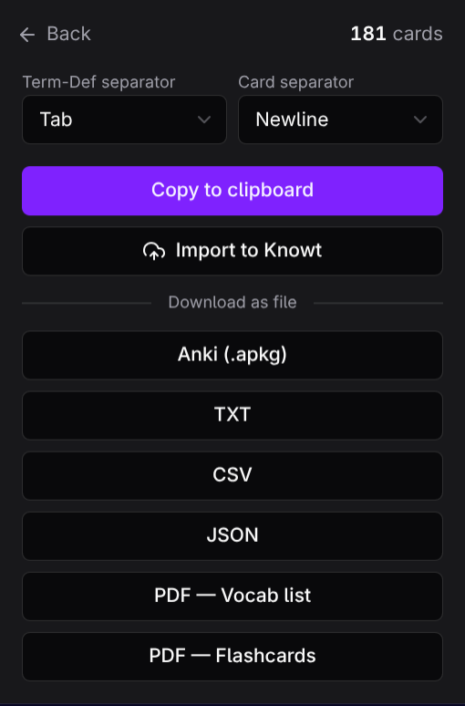
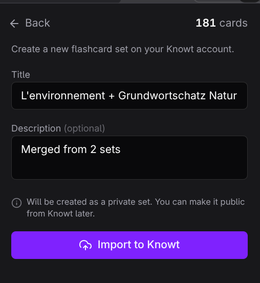
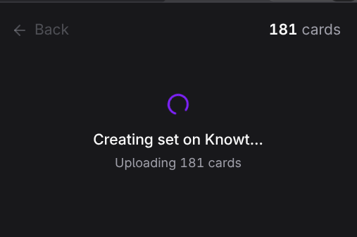

# QuickCards

Chrome extension to export Quizlet flashcards quickly.

Copy to clipboard, download as TXT/CSV/JSON/PDF/Anki, or import directly into your Knowt account — all from a clean dark-themed popup.

> Also available as a web app at **[quickcards.oseifert.ch](https://quickcards.oseifert.ch)** — paste vocab lists, JSON, or CSV and get the same exports, no install.


## Features

- **No login required** — fetches cards directly via Quizlet's web API, no account needed
- **Merge sets** — combine cards from multiple open Quizlet tabs into a single export, with automatic duplicate removal
- **Instant copy** — one click from the floating banner or popup
- **Export formats** — TXT, CSV, JSON, PDF vocab list, PDF printable flashcards, Anki `.apkg`
- **Import to Knowt** — create a new flashcard set on your Knowt account with one click. Reuses your existing Knowt session; no separate login, no API key
- **Anki export with deadline pacing** — pick a target date and get a ready-to-import `.apkg` with FSRS settings tuned for your deadline. Generates three decks: flashcards (both directions) plus two typing decks
- **Customizable separators** — pick preset or type your own for term-definition and card separators
- **Floating banner** — auto-appears on Quizlet set pages with card count and quick copy
- **PDF vocab list** — formatted table with title, numbering, and alternating row tints
- **PDF flashcards** — 2x4 grid, double-sided (terms front, definitions back mirrored for printing), auto-wrapping text with syllable-based hyphenation
- **Settings persistence** — separator preferences saved across sessions

## Screenshots

### Floating banner
Appears automatically on Quizlet set pages (bottom-right).



### Export screen
Separator combos, clipboard copy, and all download options.


### Merge sets
Combine cards from multiple open Quizlet tabs into one export.

| Main screen | Merge screen | Merged export |
|:-----------:|:------------:|:-------------:|
|  |  |  |

### Anki export
Pick a target date and get an `.apkg` with FSRS settings tuned to the deadline — shorter deadlines use higher desired retention and more aggressive learning steps. Each export contains three decks: the main flashcards deck (both directions) and two optional typing decks.


### Import to Knowt
Create a new flashcard set on your Knowt account in one click. Title and description prefill from the Quizlet set; new sets default to private.

| Form | Importing |
|:-:|:-:|
|  |  |

### PDF — Vocab list
Formatted table with violet header and alternating row tints.


### PDF — Flashcards
Double-sided 2x4 grid with cut guides. Print, fold, study.


## Install

### From a release

1. Download the latest `quick-cards-v*.zip` from [Releases](https://github.com/ImGajeed76/quick-cards/releases)
2. Unzip the archive
3. Open `chrome://extensions`, enable **Developer mode**, and click **Load unpacked**
4. Select the unzipped folder

### From source

1. Clone the repo and install dependencies:
   ```bash
   git clone https://github.com/ImGajeed76/quick-cards.git
   cd quick-cards/extension
   bun install
   ```

2. Build the extension:
   ```bash
   bun run build
   ```

3. Load in Chrome:
   - Open `chrome://extensions`
   - Enable **Developer mode**
   - Click **Load unpacked** and select the `dist/` folder

## Development

```bash
# Build extension (output: dist/)
bun run build

# Dev preview (Vite, opens localhost:3000)
bun run dev

# Generate test PDFs (output: test/output/)
bun run test:pdf
```

## Releasing

Pushing a version tag triggers a GitHub Actions workflow that builds the extension, zips it, and creates a GitHub Release with auto-generated notes.

```bash
git tag v1.1.0
git push origin v1.1.0
```

The manifest version is automatically patched to match the tag. Pre-release tags (e.g. `v2.0.0-beta.1`) are marked as pre-releases.

## How it works

QuickCards fetches flashcard data directly from Quizlet's web API (`/webapi/3.4/studiable-item-documents`) — no login or account required. It automatically paginates to retrieve all cards, even for large sets. If the API is unavailable, it falls back to scraping Quizlet's embedded `__NEXT_DATA__` JSON.

**Import to Knowt** uses the same trick in reverse. When you click the button, the extension reads Knowt's Cognito ID token from the cookie already set on `knowt.com`, decodes your user ID from it, and calls Knowt's AppSync GraphQL endpoint — the same one Knowt's own web app uses. Two mutations: one creates the set shell with your title and description, the second fills in the cards (chunked in batches of 100). Nothing is stored; the token never leaves your browser.

## Tech stack

- [Bun](https://bun.sh) — build, bundle, test
- [TypeScript](https://www.typescriptlang.org)
- [Alpine.js](https://alpinejs.dev) (CSP build) — popup interactivity
- [Tailwind CSS v4](https://tailwindcss.com) — styling
- [jsPDF](https://github.com/parallax/jsPDF) — PDF generation
- [hyphen](https://github.com/ytiurin/hyphen) — syllable-based word breaking for PDFs
- [ankipack](https://github.com/ImGajeed76/ankipack) — `.apkg` generation with FSRS support
- [sql.js](https://github.com/sql-js/sql.js) — SQLite in WebAssembly (used by ankipack)
- Chrome Extension Manifest V3

## License

[MIT](../LICENSE)
